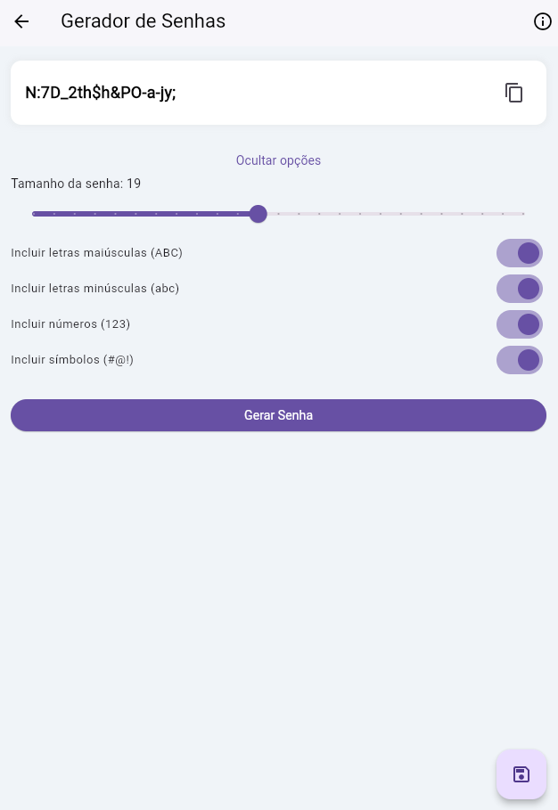

# Gerador de Senhas - Flutter App

Aplicativo móvel desenvolvido em Flutter como exercício prático, com o objetivo de gerar senhas seguras, utilizando autenticação Firebase e armazenamento Cloud Firestore.

## 🚀 Objetivo

[cite_start]Criar um aplicativo Flutter integrado ao Firebase Authentication e Cloud Firestore, que permita o login/registro do usuário, gere senhas seguras através de uma API externa (Safekey API), e exiba uma lista com as senhas geradas pelo usuário autenticado[cite: 5].

## ✨ Funcionalidades Principais

* [cite_start]**Autenticação de Usuário:** Sistema completo de Login e Registro utilizando **Firebase Authentication** (Email/Senha)[cite: 58].
* [cite_start]**Introdução (Onboarding):** Tela de introdução exibida apenas no primeiro uso, com opção para não mostrar novamente (usando **SharedPreferences**)[cite: 31, 34, 35].
* **Geração de Senhas:**
    * Consumo da API **Safekey** ([https://safekey-api-a1bd9aa97953.herokuapp.com/docs/](https://safekey-api-a1bd9aa97953.herokuapp.com/docs/)) via requisição `POST` com corpo `JSON`.
    * [cite_start]Configuração de parâmetros: tamanho da senha (`Slider`), inclusão de maiúsculas, minúsculas, números e símbolos (`SwitchListTile`)[cite: 115, 120].
    * [cite_start]Botão para copiar a senha gerada para a área de transferência[cite: 110].
* [cite_start]**Armazenamento Seguro:** As senhas geradas são salvas no **Cloud Firestore**, vinculadas ao ID do usuário autenticado[cite: 81, 122]. [cite_start]Um `AlertDialog` solicita um rótulo para cada senha antes de salvar[cite: 122].
* **Listagem e Gerenciamento:**
    * [cite_start]A `HomeScreen` exibe as senhas salvas do usuário em tempo real, utilizando `StreamBuilder`[cite: 81].
    * [cite_start]Funcionalidade para **deletar** senhas individualmente[cite: 83].
    * [cite_start]Exibição de estado de lista vazia[cite: 82, 103].
* **Interface:**
    * [cite_start]Uso de animações **Lottie** na SplashScreen e IntroScreen[cite: 21, 32].
    * [cite_start]Componentes reutilizáveis (ex: `CustomTextField`)[cite: 63].
    * [cite_start]Feedback ao usuário com `SnackBar`s e indicadores de carregamento[cite: 61, 62, 121].

## 🛠️ Tecnologias Utilizadas

* **Linguagem:** Dart
* **Framework:** Flutter
* **Backend:** Firebase
    * Firebase Authentication
    * Cloud Firestore
* **Requisições HTTP:** Pacote `http`
* **Armazenamento Local:** `shared_preferences`
* **Animações:** `lottie`
* **UI Auxiliar:** `smooth_page_indicator`, `email_validator`

## 📸 Telas (Screenshots)





## ⚙️ Como Executar o Projeto

1.  **Clone o Repositório:**
    ```bash
    git clone [URL_DO_SEU_REPOSITORIO]
    cd [NOME_DA_PASTA_DO_PROJETO]
    ```
2.  **Configure o Ambiente Flutter:** Certifique-se de ter o [Flutter SDK](https://flutter.dev/docs/get-started/install) instalado e configurado corretamente no seu PATH.
3.  **Configure o Firebase:**
    * Crie um projeto no [Firebase Console](https://console.firebase.google.com/).
    * Ative os serviços **Authentication** (com provedor Email/Senha) e **Cloud Firestore** (inicie em modo de teste).
    * Instale a FlutterFire CLI: `dart pub global activate flutterfire_cli`
    * Execute `flutterfire configure` na pasta do projeto e siga as instruções para conectar o app ao seu projeto Firebase (isso gerará o arquivo `lib/firebase_options.dart`).
4.  **Instale as Dependências:**
    ```bash
    flutter pub get
    ```
5.  **Execute o App:**
    * Conecte um dispositivo ou inicie um emulador Android/iOS.
    * Execute:
        ```bash
        flutter run
        ```

## 📝 Observações

* Este projeto foi desenvolvido como parte de um exercício acadêmico.
* A API Safekey utilizada para geração de senhas é um serviço externo hospedado no Heroku.
* O arquivo `lib/firebase_options.dart` (contendo as chaves de configuração do Firebase) está intencionalmente excluído do controle de versão via `.gitignore` por motivos de segurança.

---